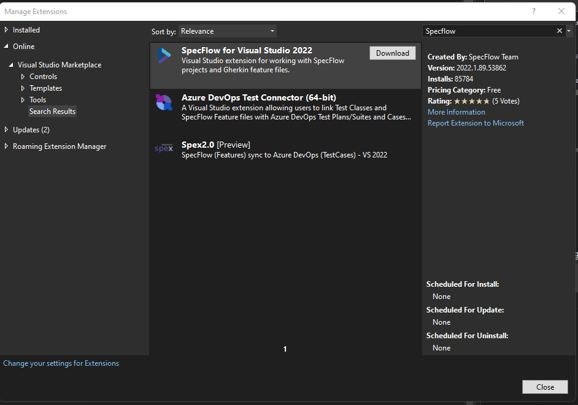

  # Specflow et le développement piloté par la comportement (BDD)

Le développement piloté par le comportement (BDD en anglais) est une approche de développement de logiciels qui met l'accent sur la compréhension des besoins des utilisateurs et sur la définition précise des exigences du système avant de commencer le développement. 

Le BDD utilise des scénarios de test écrits en langage naturel pour décrire le comportement attendu du système, qui sont utilisés pour guider le développement et pour vérifier que le système répond aux exigences.

Le BDD s'appuie sur une collaboration étroite entre les développeurs, les testeurs et les parties prenantes, pour s'assurer que le système répond aux besoins des utilisateurs et respecte les spécifications du système. Ceci ce fait en agilité lors de la cérémonie des "3 amigos".

Les scénarios de test décrivant les comportements attendus du système sont rédigés en Gherkin.

   ## Gherkin

Gherkin est un langage de description de scénario. Il permet de décrire les comportements attendus d'un système de manière claire et précise, en utilisant un langage naturel qui peut être facilement compris par tous les membres de l'équipe de développement, y compris les développeurs, les testeurs et les parties prenantes.

Les scénarios Gherkin sont écrits sous forme de listes étape par étape, qui décrivent les actions à effectuer et les résultats attendus. 

Chaque étape est précédée par un mot-clé spécifique qui indique le type d'action ou de résultat attendu :
 - "Given"
 - "When"
 - "Then"

Les scénarios Gherkin sont utilisés pour guider le développement et les tests du système, et sont généralement utilisés en conjonction avec des outils de BDD pour automatiser les tests et générer des rapports de couverture de test. Ils peuvent également être utilisés comme base de documentation pour le système, ce qui peut aider à clarifier les besoins et les exigences du système pour tous les membres de l'équipe.

Ici un exemple d'instruction Gherkin qui décrit un scénario simple dans lequel un utilisateur ajoute un produit à son panier dans un magasin en ligne :

```Gherkin
Feature: Adding a product to the cart
  As a user of the online store
  I want to be able to add products to my cart
  In order to complete my purchase

Scenario: Adding a single product to the cart
  Given the following product data:
    | name      | price |
    | product1  | $10   |
    | product2  | $20   |
  When I add "product1" to my cart
  Then the cart total should be "$10"
  And the number of items in the cart should be "1"

Scenario: Adding multiple products to the cart
  Given the following product data:
    | name      | price |
    | product1  | $10   |
    | product2  | $20   |
  When I add "product1" and "product2" to my cart
  Then the cart total should be "$30"
  And the number of items in the cart should be "2"

```

Le BDD utilise également des outils pour automatiser les tests et pour générer des rapports de couverture de test, ce qui peut aider à améliorer la qualité du logiciel et à accélérer le processus de développement, comme Specflow.

## Specflow pour executer le scénario ##


SpecFlow est une solution d'automatisation des tests pour .NET basée sur le paradigme BDD. SpecFlow est utilisé pour définir, gérer et exécuter automatiquement des tests d'acceptation lisibles par l'homme dans des projets .NET.

Afin d'utiliser le scénario à l'aide de Specflow dans un projet C#. Nous allons suivre les étapes suivante :
 - Installez l'extension SpecFlow pour Visual Studio à partir de la galerie de extensions de Visual Studio ou téléchargez et installez le paquet NuGet SpecFlow.
  
 - Ajoutez une référence à SpecFlow en utilisant le Gestionnaire de package NuGet dans notre projet.
 - Créez un nouveau fichier de spécification de fonctionnalité en utilisant le modèle de fichier SpecFlow fourni par l'extension. Ce fichier contiendra vos scénarios Gherkin défini plus haut.
 - Définissez les étapes de votre scénario en utilisant les annotations de méthode de SpecFlow et en écrivant du code C# qui implémente ces étapes. Comme ci-dessous :

```C#

[Given(@"Given the following product data:")]
public void GivenProductData(Table table)
{
    // Initialize product data from the Gherkin table
}

[When(@"When I add ""(.*)"" to my cart")]
public void WhenIAddProductToCart(string productName)
{
    // Add the product to the cart
}

[Then(@"Then the cart total should be ""(.*)""")]
public void ThenCartTotalShouldBe(string expectedTotal)
{
    // Verify that the cart total is correct
}

[Then(@"And the number of items in the cart should be ""(.*)""")]
public void ThenCartItemCountShouldBe(int expectedCount)
{
    // Verify that the number of items in the cart is correct
}

```

- Exécutez vos scénarios de test en utilisant l'outil de test de Visual Studio ou en utilisant l'interface de ligne de commande de SpecFlow.

## Conclusion

Mettre en place Specflow et le BDD sur vos projet vous décrire et exécuter des tests de manière claire et concise, encourager la collaboration entre les membres de l'équipe de développement, documenter le comportement attendu du logiciel et automatiser les tests.

Le BDD met l'accent sur la collaboration  et la communication poru s'assurer que le produit réponde aux besoins des utilisateurs finaux.

Vous pourrez ainsi assurer des livraison fiable et robuste en s'assurant des tests de non régréssion facilement, tout en évitant les malaentendu entre les différents parties prenantes.

